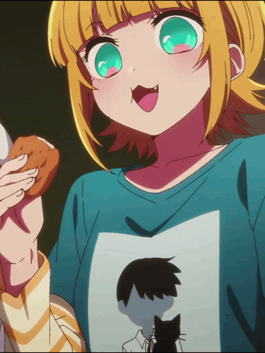
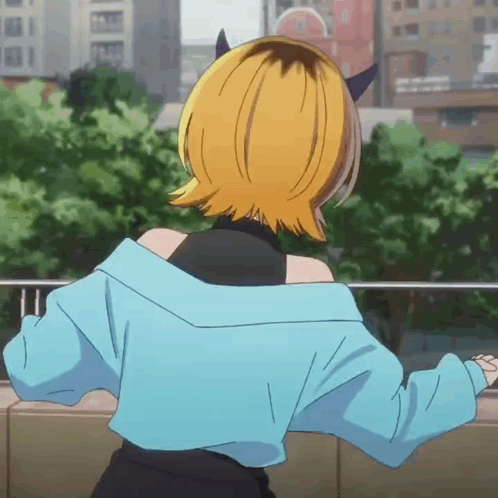

₍^. .^₎⟆ Go small or don't go home

  
 
  
 
 <i>「 building tiny things with unnecessarily large amounts of love 」</i> 
 
  

🐾 about_me.exe

<pre>
  ╭────────────────────────────────────────╮
  │ > loading profile...                   │
  │                                        │
  │ ✦ human                               │
  │ ✦ software enjoyer                    │
  │ ✦ professional overthinker            │
  │ ✦ collector of side projects          │
  │ ✦ powered by caffeine & curiosity     │
  │                                        │
  │ status: [ █████████░ ] mostly alive    │
  ╰────────────────────────────────────────╯ </pre>

## 🏆 HackerRank Stats

<!-- HACKERRANK_STATS_START -->
<!-- HACKERRANK_STATS_END -->

## 🌸 currently vibing with

 ⌨️ code　🎧 music　🌙 late nights　🍜 snacks　📺 anime　🐈 cats 
 
  

My philosophy:

If it can be made smaller, cuter, faster, or more unnecessarily complicated —
I will probably do that.

  

⚡ tech_stack

  

📊 stats

   
 
  

🎀 some things i've made

<pre>
  ╭──────────────────────────────────────────╮
  │                                          │
  │ 🌱 tiny projects                         │
  │ ✦ questionable experiments               │
  │ ✦ tools I wished existed                 │
  │ ✦ things built at unreasonable           │
  │    hours of the night                    │
  │                                          │
  ╰──────────────────────────────────────────╯ </pre>

Check out my repositories — there is probably something broken in there.

🌙 the end

 <i>Thanks for stopping by ♡</i>    <code>~ 404 motivation not found ~</code>    ₍^. .^₎⟆ 
 
  
 
  

